# Stilnovo - Reinvent your space: Where design with history finds its new home.

## 👥 Miembros del Equipo
| Nombre y Apellidos | Correo URJC | Usuario GitHub |
|:--- |:--- |:--- |
| Gabriele Antonio Ricucci | ga.ricucci.2025@alumnos.urjc.es | @gabrieleri |
| Victor Hugo Oliveira Petroceli | vh.deoliveira.2023@alumnos.urjc.es | @CodVictor |
| Raúl Tejada Merinero | r.tejada.2023@alumnos.urjc.es | @raultejada24 |
| Ariel Rodríguez Lozano | a.rodriguezl.2023@alumnos.urjc.es | @Ariel1725 |
| Alonso Gutierrez Sánchez | a.gutierrez.2023@alumnos.urjc.es | @alonsoo-cmd |

---

## 🎭 **Preparación 1: Definición del Proyecto**

### **Descripción del Tema**
Stilnovo es una plataforma de compra/venta de objetos usados enfocada en dar un "nuevo estilo" a artículos de segunda mano. La aplicación permite a los usuarios publicar anuncios, gestionar transacciones seguras y fomentar la economía circular a través de un mercado digital estético y funcional.

### **Entidades**
Indicar las entidades principales que gestionará la aplicación y las relaciones entre ellas:

1. **Usuario**: Almacena información personal, roles, avatar y Balance Económico actual.
2. **Producto**: Artículos para la venta con descripción, precio, categoría y fotos.
3. **Transacción**: Registra el proceso de compra vinculando a un comprador, un vendedor y un producto.
4. **Valoración**: Sistema de feedback con comentario y puntuación tras una transacción.

**Relaciones entre entidades:**
- Usuario - Producto: Un usuario puede publicar múltiples productos (propietario). Relación 1:N.
- Transacción - Usuario/Producto: Una transacción vincula obligatoriamente a un comprador, un vendedor y un único artículo vendido.
- Valoración - Transacción: Cada valoración está asociada a una transacción completada. Relación 1:1.
- Producto - Categoría: Los productos se agrupan por categorías para facilitar la búsqueda.

### **Permisos de los Usuarios**
Describir los permisos de cada tipo de usuario e indicar de qué entidades es dueño:

* **Usuario Anónimo**: 
  - Permisos: Navegar por la web, consultar el catálogo de productos y utilizar el buscador. Solo consulta información pública.
  - No es dueño de ninguna entidad

* **Usuario Registrado**: 
  - Permisos: Publicar artículos con fotos, realizar compras, acceder a su historial detallado de sus compras y ventas, gestionar su perfil con avatar, gestionar su inventario, editar/borrar artículos subidos, visualización de analíticas (puntuación del vendedor, ingresos, distribución por categorias, etc) y generación de PDFs (facturas y datos analíticos), Digital Seller Card con código QR (para la verificación de identidad en encuentros físicos) entre otros.
  - Es dueño de: Sus propios productos publicados, su perfil de usuario y las valoraciones que emita.

* **Administrador**: 
  - Permisos: Control total sobre la información. Puede moderar contenido, eliminar productos que infrinjan normas o banear usuarios.
  - Es dueño de: Gestiona todas las entidades de la plataforma.

### **Imágenes**
Indicar qué entidades tendrán asociada una imagen:

- **Usuario**: Una imagen de avatar personalizada.
- **Producto**: Una imagen descriptiva por cada artículo anunciado.

### **Gráficos**
Para ofrecer una experiencia de gestión basada en datos, la aplicación integra visualizaciones dinámicas que permiten al usuario y al administrador monitorizar el rendimiento comercial en tiempo real.

- **Gráfico 1**: Distribución de Ventas por Categoría (Donut Chart): Ubicado en el Dashboard de usuario, este gráfico representa proporcionalmente el éxito de ventas en las categorías de Home, Tech, Art y Cars.
- **Gráfico 2**: Evolución de Ingresos Mensuales (Line Chart): Visualización temporal que muestra la tendencia de ingresos del usuario a lo largo del año (user-statistics.jpg), facilitando la identificación de picos de demanda.
- **Gráfico 3**: Análisis de Visitas vs. Interés (Bar Chart): Gráfico de barras comparativo que mide el tráfico recibido frente a las interacciones reales (compras) por cada tipo de producto.
  
### **Tecnología Complementaria**
Se han seleccionado tecnologías que extienden las capacidades básicas de la web para simular un entorno de producción real.

- **Generación de PDFs**: Implementación de una librería para la creación automática de facturas y recibos de compra, descargables directamente desde el panel de órdenes, así como la generación de PDFs con las analíticas del usuario y de etiquetas de envío tras una transacción.
- **Envío de Correos (Mail Service)**: Integración de un servicio de mensajería para gestionar la comunicación inicial entre interesados. Al pulsar "Send Message", el sistema dispara un correo automático al vendedor con los detalles de la consulta del comprador.

### **Algoritmo o Consulta Avanzada**
El sistema no se limita a mostrar datos, sino que procesa la actividad del usuario para personalizar su experiencia de navegación.

- **Algoritmo/Consulta**: Sistema de Recomendaciones personalizado.
- **Descripción**: Muestra en la página de inicio "Productos que te pueden interesar" basándose en las categorías que el usuario ha comprado o visitado previamente.

---

## 🛠 **Preparación 2: Maquetación de páginas con HTML y CSS**

### **Vídeo de Demostración**
📹 **[Enlace al vídeo en YouTube](https://youtu.be/lXqGTZpMamk?si=9I0j98zrY1fShL06)**
> Vídeo mostrando las principales funcionalidades de la aplicación web.

### **Diagrama de Navegación**
Diagrama que muestra cómo se navega entre las diferentes páginas de la aplicación:


**Descripción del flujo de navegación:**  
Mapa visual que organiza la navegación por colores (Azul: Todos los Usuarios, Amarillo: Usuario Registrado, Verde: Administrador) y utiliza las miniaturas de las capturas de la siguiente sección como nodos del sistema.

### **Capturas de Pantalla y Descripción de Páginas**

#### **1. Página Principal / Home**


**Descripción:**
Punto de entrada principal que presenta la propuesta de valor y permite la navegación hacia el catálogo y los formularios de acceso.

#### **2. Catálogo Público (Featured Treasures) / Home**
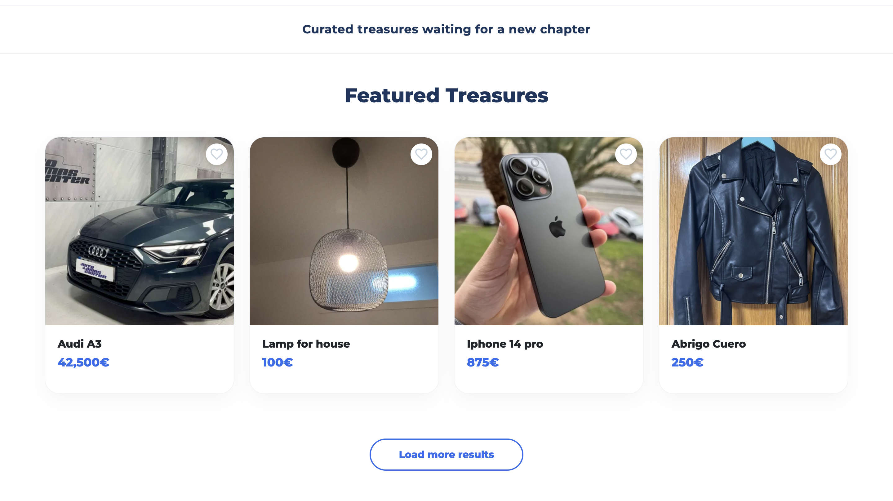

**Descripción:**
Visualización de la entidad Producto con datos de ejemplo representativos, permitiendo al usuario anónimo consultar el stock disponible.

#### **3. Detalle de Producto**


**Descripción:**
Vista completa de la entidad con especificaciones técnicas, precio y acceso a la tecnología de contacto por email.

#### **4. Detalle Técnico y Motor de Recomendaciones**


**Descripción:**
Parte inferior de la ficha de producto que muestra las especificaciones y la descripción del vendedor. Destaca la sección "You may also like", que es la representación visual del Algoritmo Avanzado: el sistema consulta la base de datos para sugerir dinámicamente artículos de categorías afines o complementarias al producto actual.

#### **5. Interfaz de Autenticación**


**Descripción:**
Formulario de acceso gestionado por roles para discriminar entre el panel de usuario y el panel de administración.

#### **6. Registro de Usuarios**
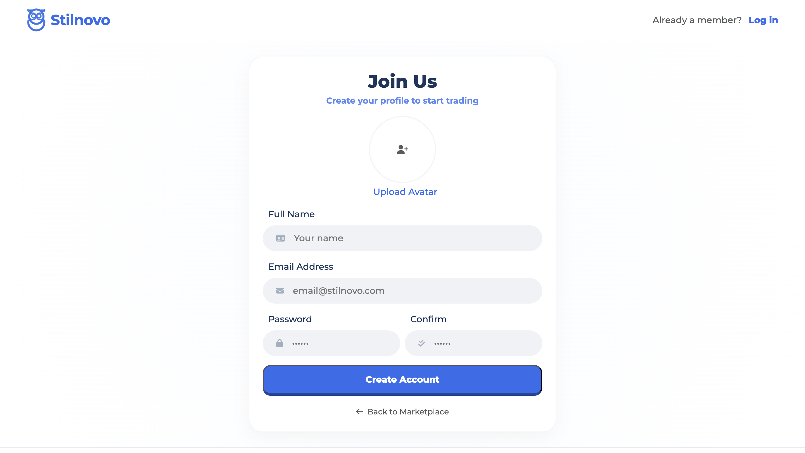

**Descripción:**
Interfaz que permite la creación de nuevas cuentas en la base de datos para interactuar con el marketplace.

#### **Área Privada (Usuario Registrado)**

#### **7. Panel de Actividad (Analytics Overview)**


**Descripción:**
Vista personalizada que utiliza gráficos para monitorizar los ingresos y las ventas del usuario.

#### **8. Gestión de Inventario Propio**
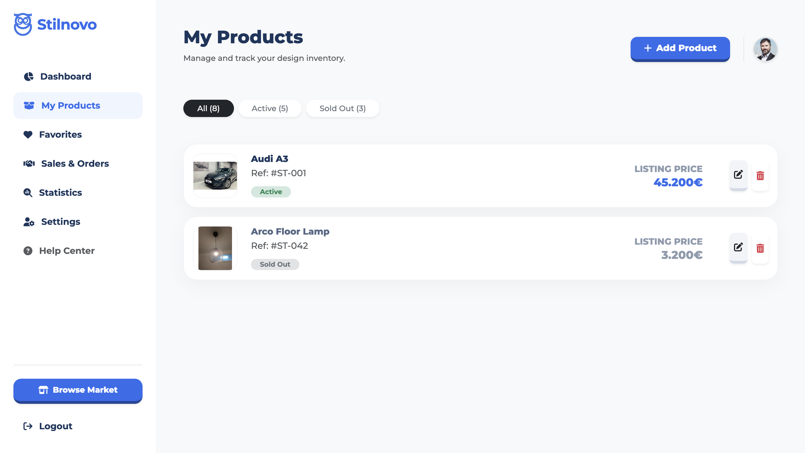

**Descripción:**
Listado de la entidad Producto donde el dueño puede visualizar sus anuncios y acceder a las opciones de borrado o edición.

#### **9. Formulario de Publicación**


**Descripción:**
Interfaz para la creación de nuevos elementos en la base de datos, incluyendo la subida de imágenes.

#### **10. Formulario de Edición**


**Descripción:**
Interfaz para la edición de elementos en la base de datos, incluyendo la cambio de imágenes.

#### **11. Productos Favoritos**


**Descripción:**
Listado de la entidad Producto donde el dueño podrá visualizar productos agregados como "Favoritos".

#### **12. Historial de Transacciones**
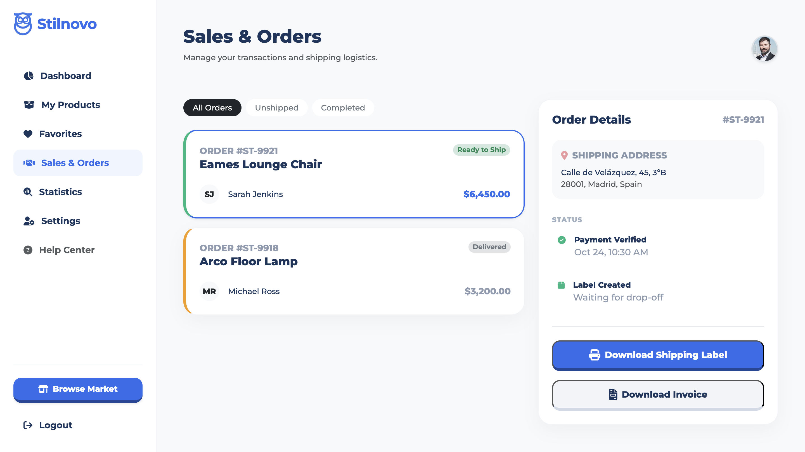

**Descripción:**
Registro de compras y ventas que integra la Tecnología Complementaria de generación de facturas en PDF.


#### **13. Análisis de Datos G1 y G2**
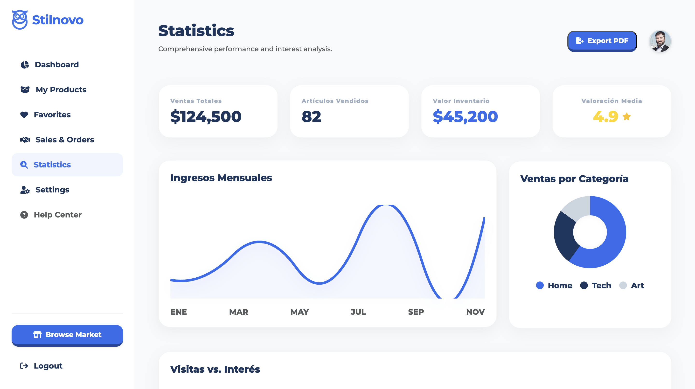

**Descripción:**
Implementación de gráficos de líneas y tarta para visualizar la evolución de ingresos y ventas por categoría.

#### **14. Gráfico de Interés G3**
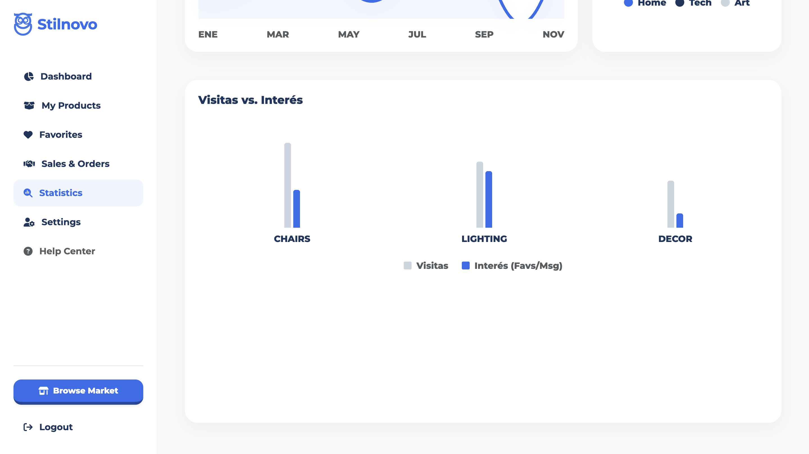

**Descripción:**
Gráfico de barras avanzado que compara visitas frente a interacciones reales por categoría de producto.

#### **15. Perfil y Verificación**


**Descripción:**
Gestión de datos personales y visualización de la Digital Seller Card para transacciones seguras.

#### **Administrador**
#### **16. Monitor Global de la Plataforma**


**Descripción:**
Dashboard exclusivo con KPIs de sistema, usuarios reportados y volumen total de anuncios.

#### **17. Gestión de Usuarios**


**Descripción:**
Herramienta de moderación que permite al administrador realizar acciones de baneo o purga de datos sobre cualquier perfil.

#### **18. Inventario Global**


**Descripción:**
Registro maestro de todos los productos del marketplace, con permisos para editar o eliminar cualquier anuncio fraudulento.

#### **19. Auditoría Financiera**


**Descripción:**
Vista de la entidad Transacción a nivel global para gestionar disputas y reembolsos.

---

## 🛠 **Práctica 1: Web con HTML generado en servidor y AJAX**

### **Vídeo de Demostración**
📹 **[Enlace al vídeo en YouTube](https://youtu.be/zg4VRbsN4g4)**
> Vídeo mostrando las principales funcionalidades de la aplicación web.

### **Navegación y Capturas de Pantalla**

#### **Diagrama de Navegación**
Diagrama actualizado que muestra cómo se navega entre las diferentes páginas de la aplicación:


**Descripción del flujo de navegación:**  
Mapa visual que organiza la navegación por colores (Azul: Todos los Usuarios, Amarillo: Usuario Registrado, Verde: Administrador) y utiliza las miniaturas de las capturas de la siguiente sección como nodos del sistema.

#### **Capturas de Pantalla Actualizadas**

#### **Área Privada (Usuario Registrado)**

#### **1. Panel de Actividad (Dashboard)**
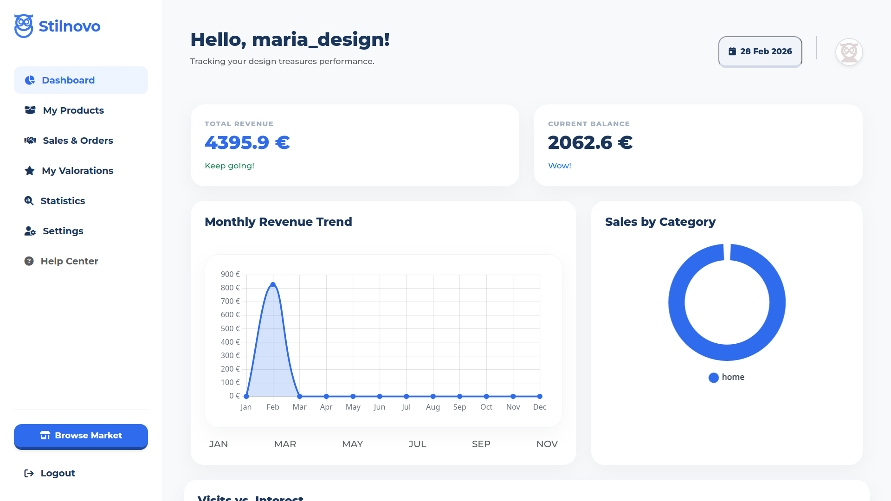

**Descripción:**
Vista personalizada del usuario que muestra estadísticas financieras en tiempo real, incluyendo balance actual, ingresos totales, y resumen de ventas. Permite al usuario monitorizar su rendimiento comercial en la plataforma.

#### **2. Gestión de Inventario Propio (My Products)**
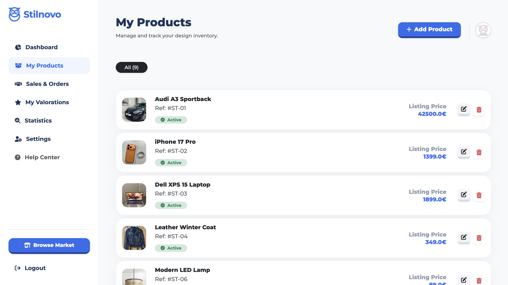

**Descripción:**
Listado completo de productos publicados por el usuario, con opciones de edición, eliminación y gestión del estado de cada artículo. Visualización de la entidad Producto donde el dueño tiene control total sobre sus anuncios.

#### **3. Formulario de Publicación de Producto (New Product)**


**Descripción:**
Interfaz para la creación de nuevos artículos en el marketplace, incluyendo nombre, categoría, precio, ubicación, descripción detallada y subida de imágenes. Validación de campos obligatorios antes del envío.

#### **4. Formulario de Edición de Producto (Edit Product)**


**Descripción:**
Interfaz de modificación de productos existentes con todos los campos editables, incluyendo la posibilidad de cambiar las imágenes asociadas. Mantiene la integridad de los datos del producto.

#### **5. Historial de Ventas y Pedidos (Sales & Orders)**


**Descripción:**
Registro completo de compras y ventas realizadas por el usuario. Incluye detalles de transacciones, fechas, importes y estado de cada operación. Integra la Tecnología Complementaria de generación de facturas en PDF descargables.

#### **6. Análisis de Ventas por Categoría y Evolución de Ingresos (Statistics)**
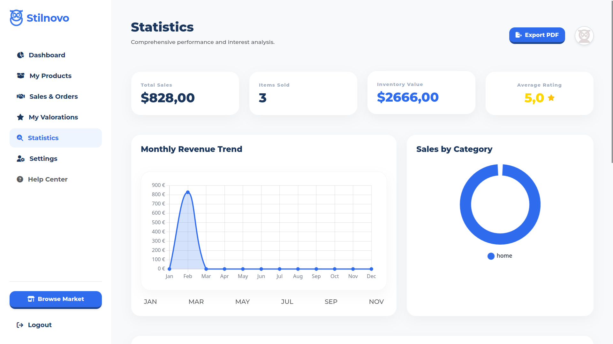

**Descripción:**
Implementación de gráficos avanzados (Gráfico 1: Donut Chart de distribución por categoría y Gráfico 2: Line Chart de evolución temporal) para visualizar el rendimiento comercial del usuario a través de datos históricos.

#### **7. Gráfico de Interés y Visitas (Statistics - Bar Chart)**


**Descripción:**
Gráfico de barras comparativo (Gráfico 3) que mide el tráfico recibido versus las interacciones reales (favoritos/compras) por cada categoría de producto, permitiendo identificar patrones de comportamiento del usuario.

#### **8. Configuración de Perfil de Usuario (Edit Profile)**


**Descripción:**
Gestión completa de datos personales del usuario, incluyendo nombre de usuario, correo electrónico, avatar, biografía, información de tarjeta de crédito y visualización de la Digital Seller Card con código QR para verificación de identidad.

#### **9. Mis Valoraciones Enviadas y Pendientes (My Valorations)**


**Descripción:**
Vista de todas las valoraciones enviadas por el usuario como comprador. Muestra la puntuación en estrellas, comentarios de compradore y producto valorado además de las valoraciones en estado pendiente de valorar, permitiendo gestionar la reputación en la plataforma.

#### **10. Valoración en Sales & Orders (Sales & Orders Valoration)**
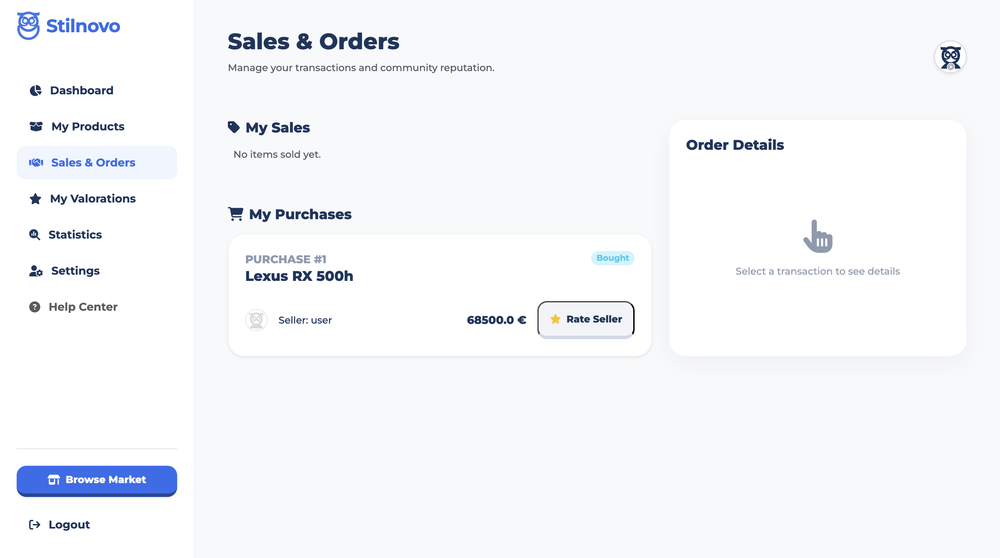

**Descripción:**
Interfaz que muestra una valoración pendiente en Sales & Orders.

#### **11. Editar Valoración (Edit Valoration)**


**Descripción:**
Interfaz para modificar una valoración previamente emitida, permitiendo actualizar la puntuación en estrellas y el comentario asociado a una transacción completada. Mantiene la trazabilidad de las reviews.

#### **12. Área de ayuda al usuario (Help Center)**
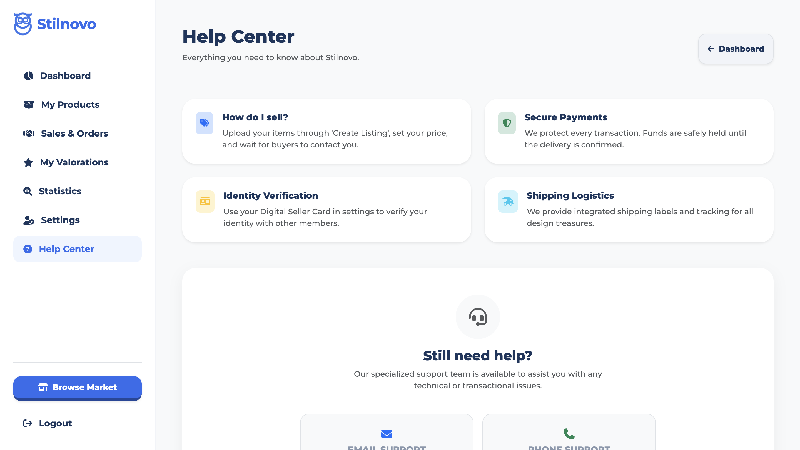

**Descripción:**
Interfaz de preguntas frecuentes y acceso a información de contacto a Stilnovo.

#### **13. Perfil del Vendedor (Seller Profile)**
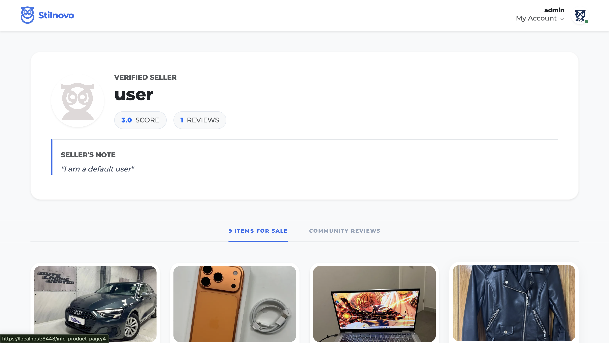

**Descripción:**
Interfaz de donde se muestra la información de un vendedor, esta información es; valoración media, número de valoraciones recibidas, nombre, su descripción y sus productos.

#### **14. Valoraciones del Vendedor (Seller Valorations)**


**Descripción:**
Interfaz de donde se muestra las valoraciones recibidas de un vendedor; se muestra una lista de las valoraciones a ese vendedor por parte de otros usuarios que compraron un producto de este vendedor. Esto ayuda a los usuarios a saber que reputaciñon tiene dicho vendedor. 

#### **Área de Administración**

#### **15. Monitor Global de la Plataforma (Admin Dashboard)**


**Descripción:**
Dashboard exclusivo del administrador con KPIs de sistema: total de usuarios registrados, productos activos, transacciones realizadas, ingresos globales y alertas de moderación. Vista centralizada para la supervisión de la plataforma.

#### **16. Gestión Global de Usuarios (Admin User Management)**


**Descripción:**
Herramienta de moderación que permite al administrador visualizar todos los usuarios registrados, sus datos de contacto, estado de la cuenta y realizar acciones administrativas como baneos, desbaneos o eliminación de perfiles.

#### **17. Inventario Global de Productos (Admin Global Inventory)**
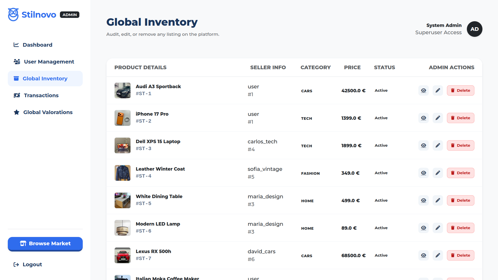

**Descripción:**
Registro maestro de todos los productos publicados en el marketplace, con información detallada del vendedor, categoría, precio y estado. Permite al administrador editar o eliminar cualquier anuncio que infrinja las normas de la plataforma.

#### **18. Auditoría Financiera Global (Admin Global Transactions)**
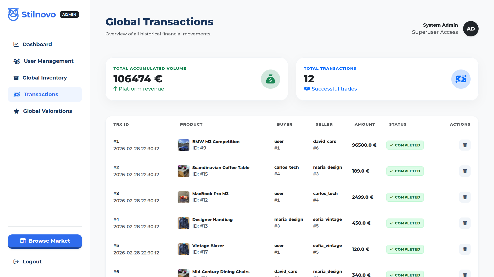

**Descripción:**
Vista completa de todas las transacciones realizadas en la plataforma, incluyendo comprador, vendedor, producto, fecha, importe y estado. Herramienta para auditoría financiera, gestión de disputas y análisis de volumen de negocio.

#### **19. Gestión Global de Valoraciones (Admin Global Valorations)**


**Descripción:**
Panel administrativo para supervisar todas las valoraciones realizadas en la plataforma. Permite identificar reviews fraudulentas, gestionar reportes y mantener la integridad del sistema de reputación de vendedores.

#### **20. Baneo de un Usuario (User Ban)**
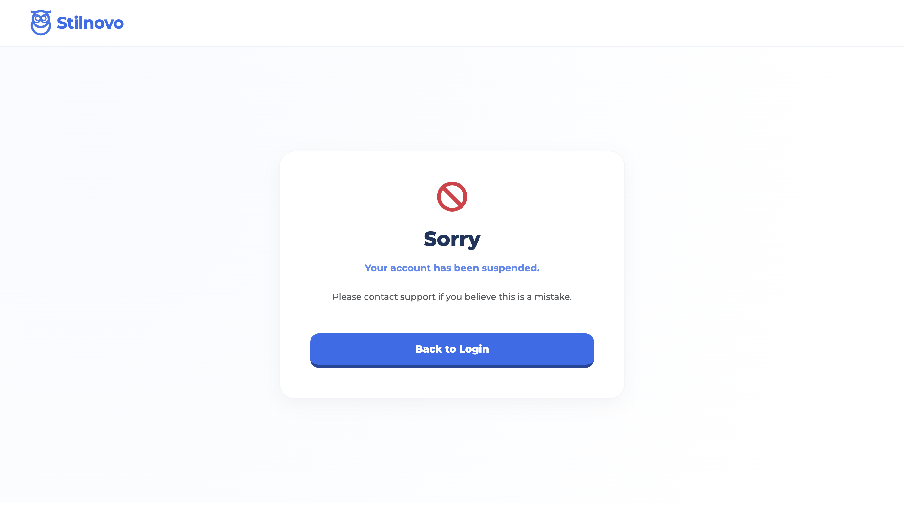

**Descripción:**
Cuando el administrador bloquee a un usuario en **Stilnovo**, si este intenta iniciar sesión, el sistema le mostrará una página informativa indicando que su cuenta ha sido suspendida de la plataforma.


#### **21. Footer**
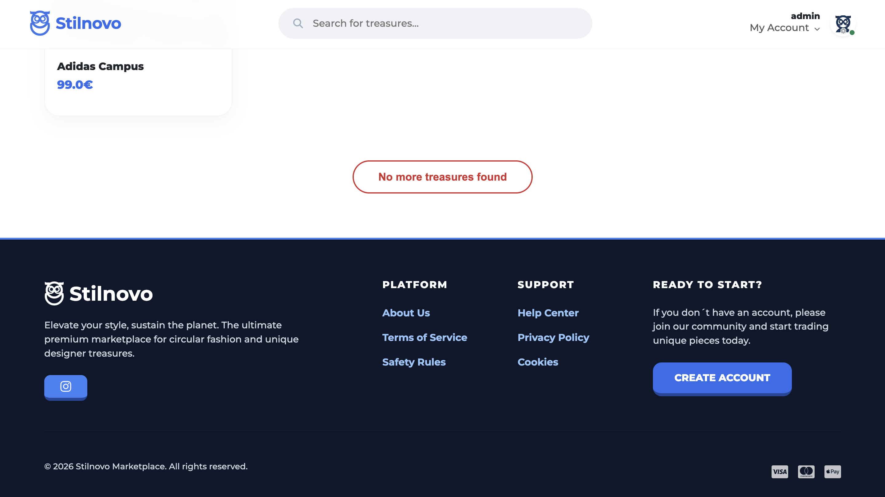

**Descripción:**
Interfaz de donde se muestra el nuevo diseño del pie de página de Stilnovo, este incluye modales informativos, enlaces a redes sociales y la posibilidad de crear una cuenta nueva.

#### **22. Usuario Baneado (Banned User)**


**Descripción:**
Aqui se muestra un ejemplo de modal del footer.

### **Instrucciones de Ejecución**

#### **Requisitos Previos**
- **Java**: versión 21 o superior
- **Maven**: versión 3.8 o superior
- **MySQL**: versión 8.0 o superior
- **Git**: para clonar el repositorio

#### **Pasos para ejecutar la aplicación**

1. **Clonar el repositorio**  
   Crea una carpeta para el proyecto, accede a ella y clona el repositorio:

   ```bash
   git clone https://github.com/CodeURJC-DAW-2025-26/practica-daw-2025-26-grupo-5.git
   cd practica-daw-2025-26/practica-daw-2025-26-grupo-5
   ```

2. **Acceder al directorio del backend**  
   Entra en la carpeta que contiene la lógica del servidor:

   ```bash
   cd backend
   ```

3. **Levantar la base de datos**  
   Asegúrate de tener abierto Docker Desktop (o cualquier otro motor de Docker) y ejecuta el script para inicializar la base de datos:

   ```bash
   ./start_db.sh
   ```

   **Nota:** Espera unos segundos tras ejecutar el script para asegurar que la base de datos se ha creado y configurado correctamente antes del siguiente paso.

4. **Ejecutar la aplicación**  
   Localiza el archivo principal del proyecto en tu IDE (IntelliJ, VS Code, etc.):

   `src/main/java/es/stilnovo/library/Application.java`

5. **Acceso a la web**  
   Una vez que la aplicación esté en marcha, abre tu navegador y accede a:

   ```bash
   https://localhost:8443
   ```

Solo un recordatorio: como la aplicación usa HTTPS en el puerto 8443, la primera vez que entres el navegador te dará un aviso de "Conexión no privada" (por el certificado auto-firmado de desarrollo). Solo tienes que darle a **"Configuración avanzada"** y **"Acceder a localhost (sitio no seguro)"** para entrar.
#### **Credenciales de prueba**
- **Usuario Admin**: usuario: `admin`, contraseña: `admin`
- **Usuario Registrado**: usuario: `user`, contraseña: `user`

### **Diagrama de Entidades de Base de Datos**

Diagrama mostrando las entidades, sus campos y relaciones:


> **Descripción del Diagrama:**
> 
> El diagrama EER generado desde MySQL Workbench muestra las tablas principales y las auxiliares creadas por Hibernate:
> 
> - **Tablas principales:** `user_table`, `product_table`, `transaction_table`, `image_table`, `inquiry_table`, `user_interactions`, `valoration_table`.
> - **Tablas auxiliares:** `user_table_favorite_products` (favoritos, relación N:M) y `user_table_roles` (roles por usuario).
> 
> **Relaciones clave (según el diagrama):**
> - `user_table` **1:N** `product_table` (seller_user_id)
> - `product_table` **1:1** `image_table` (image_id)
> - `transaction_table` **N:1** `user_table` (buyer_user_id y seller_user_id)
> - `transaction_table` **1:1** `product_table` (product_id)
> - `inquiry_table` **N:1** `user_table` (buyer_user_id) y **N:1** `product_table` (product_id)
> - `user_interactions` **N:1** `user_table` y **N:1** `product_table`
> - `valoration_table` **N:1** `user_table` (buyer_user_id y seller_user_id) y **N:1** `transaction_table`

### **Diagrama de Clases y Templates**

Diagrama de clases de la aplicación con diferenciación por colores o secciones:


> Este diagrama detalla la arquitectura lógica de **Stilnovo**, estructurada en un modelo de capas que garantiza la separación de responsabilidades y la escalabilidad del sistema.
> 
> **Organización de Componentes:**
> * **Vistas (Morado):** Capa de presentación que gestiona la interfaz de usuario, integrando tanto páginas completas como fragmentos HTML dinámicos para una experiencia fluida.
> * **Controladores (Verde):** Encargados de interceptar las peticiones del cliente, coordinar el flujo de navegación y delegar la ejecución de reglas de negocio.
> * **Servicios (Rojo):** Núcleo de la aplicación donde se procesa la lógica de negocio. Centraliza funciones complejas como el cálculo de inventarios, el enfriamiento de notificaciones y la integración con servicios de infraestructura (Email y PDF).
> * **Repositorios (Azul):** Capa de persistencia que utiliza Spring Data JPA para abstraer y gestionar el acceso a los datos de forma eficiente.
> * **Entidades/Modelos (Gris):** Representación de los objetos de dominio, definiendo las reglas de integridad y las relaciones de composición esenciales para el negocio (User, Product, Transaction, etc.).
> 
> **Principios de Diseño:**
> El diagrama refleja un flujo de dependencias unidireccional (Controlador -> Servicio -> Repositorio), minimizando el acoplamiento y permitiendo que la lógica de negocio sea independiente de la tecnología de persistencia o de la interfaz de usuario.

### **Participación de Miembros en la Práctica 1**

#### **Alumno 1 - Victor Hugo Oliveira Petroceli**

Responsable del desarrollo de la arquitectura backend y de la lógica de negocio en las áreas de valoraciones, transacciones, productos y usuario. He implementado el flujo completo de transacciones P2P, el sistema de valoraciones, la seguridad mediante Spring Security y el ciclo de vida integral de los productos . Además, he gestionado la integración de imágenes y la optimización de la persistencia de datos y relaciones complejas entre entidades en la base de datos.

| Nº | Commits | Files |
|:------------: |:------------:| :------------:|
|1| [feat: implement full p2p transaction flow, user ratings, and profile settings](https://github.com/CodeURJC-DAW-2025-26/practica-daw-2025-26-grupo-5/commit/0e7534c90c98f684d3dfa4065fc83d454309ab15) | [UserWebController](https://github.com/CodeURJC-DAW-2025-26/practica-daw-2025-26-grupo-5/blob/main/backend/src/main/java/es/stilnovo/library/controller/UserWebController.java) |
|2| [refactor: major security overhaul, service-layer migration, and UI fixes](https://github.com/CodeURJC-DAW-2025-26/practica-daw-2025-26-grupo-5/commit/4a93d87216e616314c06cf6c1e8f7e82644c6972) | [UserService](https://github.com/CodeURJC-DAW-2025-26/practica-daw-2025-26-grupo-5/blob/main/backend/src/main/java/es/stilnovo/library/service/UserService.java) |
|3| [Product editing and adding implemented with search and categories](https://github.com/CodeURJC-DAW-2025-26/practica-daw-2025-26-grupo-5/commit/cec4e04d380abd3adf90684a2d8390aec0b11a61) | [ProductService](https://github.com/CodeURJC-DAW-2025-26/practica-daw-2025-26-grupo-5/blob/main/backend/src/main/java/es/stilnovo/library/service/ProductService.java) |
|4| [Signup working](https://github.com/CodeURJC-DAW-2025-26/practica-daw-2025-26-grupo-5/commit/967380ebc229fc60ffbfb0b15d48551f6842120f) | [ValorationService](https://github.com/CodeURJC-DAW-2025-26/practica-daw-2025-26-grupo-5/blob/main/backend/src/main/java/es/stilnovo/library/service/ValorationService.java) |
|5| [feat(admin): implement global transactions page and secure deletion logic](https://github.com/CodeURJC-DAW-2025-26/practica-daw-2025-26-grupo-5/commit/adf056929cc3494bd094cb1659b6812c7e9b7933) | [TransactionService](https://github.com/CodeURJC-DAW-2025-26/practica-daw-2025-26-grupo-5/blob/main/backend/src/main/java/es/stilnovo/library/service/TransactionService.java) |

---

#### **Alumno 2 - Alonso Gutiérrez Sánchez**

Responsable de el botón de load-more gestionado mediante un archivo JavaScript AJAX y de la creación de los gráficos de distribución de ventas por categoría (Donut Chart), el de evolución de ingresos mensuales (Line Chart) y el de análisis de visitas contra interés (Bar Chart).

| Nº    | Commits      | Files      |
|:------------: |:------------:| :------------:|
|1| [Button load more correct](https://github.com/alonsoo-cmd/practica-daw-2025-26-grupo-5/commit/d06f29e149b58e125f89c6f7ec527f8d2e32126d)  | [MainController.java](https://github.com/alonsoo-cmd/practica-daw-2025-26-grupo-5/blob/main/backend/src/main/java/es/stilnovo/library/controller/MainController.java)   |
|2| [Fix delete product problem](https://github.com/alonsoo-cmd/practica-daw-2025-26-grupo-5/commit/f80eab54e8342f1bd154f466f2733b6326826a30)  | [ProductService.java](https://github.com/alonsoo-cmd/practica-daw-2025-26-grupo-5/blob/main/backend/src/main/java/es/stilnovo/library/service/ProductService.java)   |
|3| [Donut chart at dashboard](https://github.com/alonsoo-cmd/practica-daw-2025-26-grupo-5/commit/302d00518055e584018041ed5d4b7dc69a783a46)  | [dashboard-charts.js](https://github.com/alonsoo-cmd/practica-daw-2025-26-grupo-5/blob/main/backend/src/main/resources/static/javascript/dashboard-charts.js)   |
|4| [Graph about monthly revenue and add graphs at statistics-page](https://github.com/alonsoo-cmd/practica-daw-2025-26-grupo-5/commit/31c1f423cf1de189b015544a040efa106342d060)  | [UserWebController.java](https://github.com/alonsoo-cmd/practica-daw-2025-26-grupo-5/blob/main/backend/src/main/java/es/stilnovo/library/controller/UserWebController.java)   |
|5| [Interaction graph](https://github.com/alonsoo-cmd/practica-daw-2025-26-grupo-5/commit/849c80d0ac753eb46fa4fa4e3bec9846199250c7)  | [user-page.html](https://github.com/alonsoo-cmd/practica-daw-2025-26-grupo-5/blob/main/backend/src/main/resources/templates/user-page.html)   |

---

#### **Alumno 3 - Raúl Tejada Merinero**

Responsable de implementar la generación automática de 3 tipos de documentos PDF (factura de compra, recibo de transacción e invoice del vendedor), integrando la librería iText para crear reportes profesionales. Además, he desarrollado un sistema completo de notificaciones por email con 4 templates dinámicos (confirmación de compra, mensaje de comprador, notificación de venta al vendedor, y confirmación de mensaje enviado), utilizando JavaMailSender y SMTP. He optimizado la comunicación usuario-plataforma mediante plantillas de email HTML personalizadas y he asegurado la correcta persistencia y envío de datos críticos en el flujo de transacciones.

| Nº    | Commits      | Files      |
|:------------: |:------------:| :------------:|
|1| [Emails + PDF (done)](https://github.com/CodeURJC-DAW-2025-26/practica-daw-2025-26-grupo-5/commit/5f3356464863ce14510d26b7efcc098f5d8d865b) | [MainController.java](https://github.com/CodeURJC-DAW-2025-26/practica-daw-2025-26-grupo-5/blob/main/backend/src/main/java/es/stilnovo/library/controller/MainController.java) |
|2| [Pdf Download done](https://github.com/CodeURJC-DAW-2025-26/practica-daw-2025-26-grupo-5/commit/c22f5e6afb6de1453584c667cf57f9a5070f071b)  | [UserWebController.java](https://github.com/CodeURJC-DAW-2025-26/practica-daw-2025-26-grupo-5/blob/main/backend/src/main/java/es/stilnovo/library/controller/UserWebController.java)   |
|3| [fix secure URLs from pdfs](https://github.com/CodeURJC-DAW-2025-26/practica-daw-2025-26-grupo-5/commit/953dd321c9ae1a4928028e6783aa541a5930bc54)  | [UserService.java](https://github.com/CodeURJC-DAW-2025-26/practica-daw-2025-26-grupo-5/blob/main/backend/src/main/java/es/stilnovo/library/service/UserService.java) |
|4| [Fix inquiry emails](https://github.com/CodeURJC-DAW-2025-26/practica-daw-2025-26-grupo-5/commit/6ee1d8db98149cba096ff2b8dd7b30bd74d99a8c)  | [AdminController.java](https://github.com/CodeURJC-DAW-2025-26/practica-daw-2025-26-grupo-5/blob/main/backend/src/main/java/es/stilnovo/library/controller/AdminController.java)  |
|5| [New Bought Email Update](https://github.com/CodeURJC-DAW-2025-26/practica-daw-2025-26-grupo-5/commit/b2c72482cc49939da5b4f9af6dfe4caec7c03348)  | [ProductService.java](https://github.com/CodeURJC-DAW-2025-26/practica-daw-2025-26-grupo-5/blob/main/backend/src/main/java/es/stilnovo/library/service/ProductService.java)   |

---

#### **Alumno 4 - Gabriele Antonio Ricucci**

Responsable del diseño e implementación del motor de recomendaciones (Algoritmo Avanzado), definiendo el modelo de seguimiento de interacciones de usuario y la lógica de negocio subyacente. He desarrollado la lógica de búsqueda de productos, el filtrado dinámico en la vista principal para evitar duplicidades entre recomendaciones y catálogo. Además, he gestionado la integración de estas características complejas en los controladores principales y las vistas.

| Nº    | Commits      | Files      |
|:------------: |:------------:| :------------:|
|1| [Add UserInteraction model and repository method for product recommendations](https://github.com/CodeURJC-DAW-2025-26/practica-daw-2025-26-grupo-5/commit/d24f00d25cf986163ff9b4b087c5cbada3f69fac)  | [UserInteraction.java](https://github.com/CodeURJC-DAW-2025-26/practica-daw-2025-26-grupo-5/blob/main/backend/src/main/java/es/stilnovo/library/model/UserInteraction.java)   |
|2| [implement recommendation algorithm and refactor product service](https://github.com/CodeURJC-DAW-2025-26/practica-daw-2025-26-grupo-5/commit/16f5a3bc622f8461a9c46a63694642e76f4e491b)  | [ProductService.java](https://github.com/CodeURJC-DAW-2025-26/practica-daw-2025-26-grupo-5/blob/main/backend/src/main/java/es/stilnovo/library/service/ProductService.java)   |
|3| [fix: enhance product search logic and integrate recommendations](https://github.com/CodeURJC-DAW-2025-26/practica-daw-2025-26-grupo-5/commit/327ddacac49cd04fc093eba75c74d7518cda39ff)  | [ProductRepository.java](https://github.com/CodeURJC-DAW-2025-26/practica-daw-2025-26-grupo-5/blob/main/backend/src/main/java/es/stilnovo/library/repository/ProductRepository.java)   |
|4| [feat: enhance product listing by filtering out recommended products from main search results](https://github.com/CodeURJC-DAW-2025-26/practica-daw-2025-26-grupo-5/commit/38358b1ca156b1b9ec5915ae57c3a56aec1eec99)  | [MainController.java](https://github.com/CodeURJC-DAW-2025-26/practica-daw-2025-26-grupo-5/blob/main/backend/src/main/java/es/stilnovo/library/controller/MainController.java)   |
|5| [refactor MainController and User model; add favorite products functionality](https://github.com/CodeURJC-DAW-2025-26/practica-daw-2025-26-grupo-5/commit/b7baac40766dee2f394bb960be349e1205f91e54)  | [User.java](https://github.com/CodeURJC-DAW-2025-26/practica-daw-2025-26-grupo-5/blob/main/backend/src/main/java/es/stilnovo/library/model/User.java)   |

---

#### **Alumno 5 - Ariel Rodriguez Lozano**

Responsable de la implementación completa del sistema de administración de la plataforma. He desarrollado todas las funcionalidades especiales del panel de administracion, incluyendo el Dashboard con métricas del sistema, la gestión global de usuarios con control total de ban/unban, eliminar permanentemente a usuario y edición, el inventario global con permisos de edición y borrado total, la supervisión de transacciones y el control de valoraciones. Además, he refactorizado la seguridad de las rutas administrativas mediante Spring Security para garantizar un aislamiento por roles, implementado la restricción de acceso para usuarios baneados en el flujo de login, la pagina de login incorrecto por credenciales erroneas y mejorado diversos detalles de diseño y coherencia visual en todas las vistas del panel de administración. 

| Nº    | Commits      | Files      |
|:------------: |:------------:| :------------:|
|1| [Admin user managment: ban/unban, delete, banned page](https://github.com/CodeURJC-DAW-2025-26/practica-daw-2025-26-grupo-5/commit/eb431d7147a4053e67c5a069d70324f2831b18f5)  | [AdminController.java](https://github.com/CodeURJC-DAW-2025-26/practica-daw-2025-26-grupo-5/blob/main/backend/src/main/java/es/stilnovo/library/controller/AdminController.java)   |
|2| [Merge main + admin ban/delete preserved](https://github.com/CodeURJC-DAW-2025-26/practica-daw-2025-26-grupo-5/commit/52fd6b8046b6cf9b292fb98dd532ec1d833d92fa)  | [AdminService.java](https://github.com/CodeURJC-DAW-2025-26/practica-daw-2025-26-grupo-5/blob/main/backend/src/main/java/es/stilnovo/library/service/AdminService.java)   |
|3| [admin edits user working](https://github.com/CodeURJC-DAW-2025-26/practica-daw-2025-26-grupo-5/commit/d2c20491c78687d860385143cd2f35b536e4ab4f)  | [admin-panel-page.html](https://github.com/CodeURJC-DAW-2025-26/practica-daw-2025-26-grupo-5/blob/main/backend/src/main/resources/templates/admin-panel-page.html)   |
|4| [Admin editing products from global inventory](https://github.com/CodeURJC-DAW-2025-26/practica-daw-2025-26-grupo-5/commit/7a36e48ab3c78e118b9db9a9465a7acdcca10f46)  | [admin-global-invent-page.html](https://github.com/CodeURJC-DAW-2025-26/practica-daw-2025-26-grupo-5/blob/main/backend/src/main/resources/templates/admin-global-invent-page.html)   |
|5| [align admin routes and remove public user ID access](https://github.com/CodeURJC-DAW-2025-26/practica-daw-2025-26-grupo-5/commit/06d43aff7b95904a4a4f9ccf3efbda7fcfe2ee85)  | [WebSecurityConfig.java](https://github.com/CodeURJC-DAW-2025-26/practica-daw-2025-26-grupo-5/blob/main/backend/src/main/java/es/stilnovo/library/security/WebSecurityConfig.java)   |

---

## 🛠 **Práctica 2: Incorporación de una API REST a la aplicación web, despliegue con Docker y despliegue remoto**

Nota: Para probar los endpoints POST/PUT que requieren imágenes en Postman, por favor adjunte un archivo local en la pestaña Body.

### **Vídeo de Demostración**
📹 **[Enlace al vídeo en YouTube](https://youtu.be/uGIF1hk7TAM)**
> Vídeo mostrando las principales funcionalidades de la aplicación web.

### **Documentación de la API REST**

#### **Especificación OpenAPI**
📄 **[Especificación OpenAPI (YAML)](https://github.com/CodeURJC-DAW-2025-26/practica-daw-2025-26-grupo-5/blob/main/api-docs/api-docs.yaml)**

#### **Documentación HTML**
📑 **[Documentación API REST (HTML)](https://raw.githack.com/CodeURJC-DAW-2025-26/practica-daw-2025-26-grupo-5/main/api-docs/api-docs.html)**

> La documentación de la API REST se encuentra en la carpeta `/api-docs` del repositorio. Se ha generado automáticamente con SpringDoc a partir de las anotaciones en el código Java.

### **Diagrama de Clases y Templates Actualizado**

Diagrama actualizado incluyendo los @RestController y su relación con los @Service compartidos:

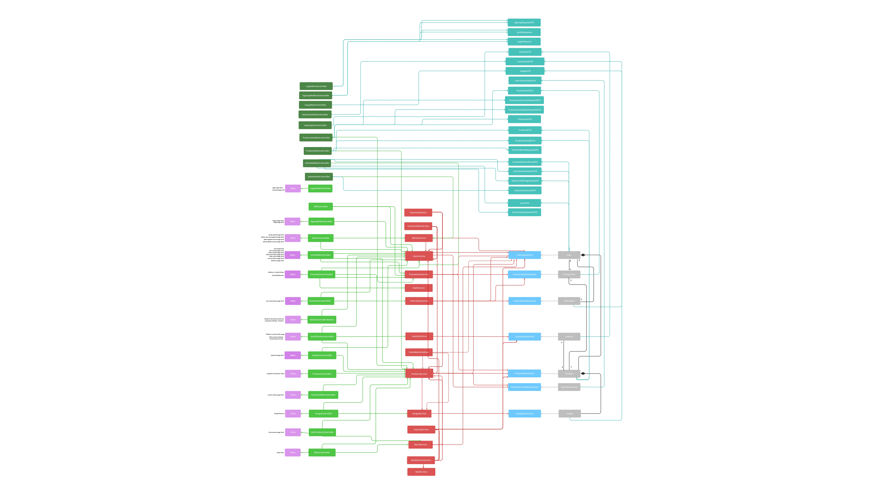

Este diagrama detalla la arquitectura lógica de **Stilnovo**, estructurada en un modelo de capas que garantiza la separación de responsabilidades y la escalabilidad del sistema.
> 
> **Organización de Componentes:**
> * **Vistas (Morado):** Capa de presentación que gestiona la interfaz de usuario, integrando tanto páginas completas como fragmentos HTML dinámicos para una experiencia fluida.
> * **Controladores (Verde):** Encargados de interceptar las peticiones del cliente, coordinar el flujo de navegación y delegar la ejecución de reglas de negocio.
> * **Controladores REST (Verde Oscuro):** Puntos de entrada de la API. Interceptan las peticiones HTTP (GET, POST, PUT, DELETE), orquestan las operaciones y devuelven respuestas estructuradas exclusivamente en formato JSON.
> * **DTOs / Objetos de Transferencia (Azul Oscuro):** Estructuras de datos ligeras (Data Transfer Objects) diseñadas para transportar información entre el cliente y el servidor. Aíslan y protegen las entidades del modelo, exponiendo solo los datos necesarios y optimizando el rendimiento.
> * **Servicios (Rojo):** Núcleo de la aplicación donde se procesa la lógica de negocio. Centraliza funciones complejas como el cálculo de inventarios, el enfriamiento de notificaciones y la integración con servicios de infraestructura (Email y PDF).
> * **Repositorios (Azul):** Capa de persistencia que utiliza Spring Data JPA para abstraer y gestionar el acceso a los datos de forma eficiente.
> * **Entidades/Modelos (Gris):** Representación de los objetos de dominio, definiendo las reglas de integridad y las relaciones de composición esenciales para el negocio (User, Product, Transaction, etc.).

> **Recomendación:** Para una mejor visualización y claridad de los detalles, se recomienda descargar la imagen y abrirla en el ordenador personal. El diagrama cuenta con suficiente resolución para una experiencia óptima al hacer zoom sobre áreas específicas de interés.

---

### **Instrucciones de Ejecución y Despliegue con Docker**

#### **1. Requisitos Previos**
- Docker (v20.10+) y Docker Compose (v2.0+) instalados.
- Cuenta en [DockerHub](https://hub.docker.com) y sesión iniciada (`docker login`).
- Repositorio clonado en tu máquina local.

#### **2. Ejecución Local (Desarrollo)**

Para levantar la aplicación en tu máquina de forma rápida:

**Paso A: Crear archivo `.env` en la raíz del proyecto**
```properties
DOCKER_HUB_USERNAME=tu-usuario-dockerhub
MYSQL_ROOT_PASSWORD=password
MYSQL_DATABASE=stilnovo
SERVER_PORT=8443
SERVER_SSL_KEY_STORE_PASSWORD=password
SERVER_SSL_KEY_PASSWORD=secret
SPRING_JPA_HIBERNATE_DDL_AUTO=update
APP_PUBLIC_BASE_URL=https://localhost:8443
```

**Paso B: Levantar contenedores**
```bash
cd docker
docker compose --env-file ../.env up -d
```
*La web estará disponible en `https://localhost:8443` y la API interactiva en `https://localhost:8443/swagger-ui.html`.*

Para detener la aplicación: `docker compose down`

---

#### **3. Flujo de Despliegue en Producción (AppWeb05)**

El proyecto incluye scripts en `PowerShell` (`.ps1`) y `Bash` (`.sh`) dentro de la carpeta `/docker` que automatizan la construcción y publicación de imágenes.

**FASE 1: Desde tu máquina (Compilar y subir cambios)**
```powershell
cd docker
docker login

# 1. Construir la imagen localmente (Maven + Docker)
.\create_image.ps1 -ImageName stilnovo-app:latest

# 2. Subir la imagen a DockerHub
.\publish_image.ps1 -DockerHubUsername tu-usuario-dockerhub
```

**FASE 2: Desde el servidor (Descargar y ejecutar)**
⚠️ *Requiere estar conectado a la red de la URJC (VPN/MyApps).*

```bash
# 1. Conectar al servidor por SSH
ssh -i ssh-keys/appWeb05.key vmuser@appWeb05.dawgis.etsii.urjc.es

# 2. Limpiar la versión vieja y sus volúmenes
sudo docker compose down -v

# 3. Descargar la nueva imagen (CRÍTICO)
sudo docker compose pull

# 4. PRIMER ARRANQUE: Crear la base de datos desde cero
sudo SPRING_APPLICATION_JSON='{"spring.jpa.hibernate.ddl-auto":"create"}' docker compose up

# 5. ARRANQUES POSTERIORES: Una vez inicializada, pulsa Ctrl+C y arranca en modo seguro (background)
sudo docker compose up -d
```

*La aplicación en producción estará disponible en `https://appweb05.dawgis.etsii.urjc.es:8443`.*

> **Nota:** Para más detalles sobre la configuración avanzada de docker, consulta el archivo  [`advanced-docker.md`](./advanced-docker.md).

### **URL de la Aplicación Desplegada**

🌐 **URL de acceso remota (URJC)**: `https://appweb05.dawgis.etsii.urjc.es:8443`

#### **Credenciales de Usuarios de Ejemplo**

| Rol | Usuario | Contraseña |
|:---|:---|:---|
| Administrador | admin | admin123 |
| Usuario Registrado | user1 | user123 |
| Usuario Registrado | user2 | user123 |

### **Participación de Miembros en la Práctica 2**

#### **Alumno 1 - Victor Hugo Oliveira Petroceli**

Mi contribución principal se ha centrado en la transición de la lógica de negocio a una arquitectura de API REST basada en entidades y la robustez del sistema. He formado parte de la reestructuración de los controladores siguiendo el principio de "Agrupación por Entidad", consolidando la lógica de Transactions, Products y Users. He implementado el sistema de gestión de perfil de usuario (incluyendo carga de imágenes multipart y dashboards de estadísticas) y la lógica de transacciones/valoraciones. Además, configuré la seguridad, la especificación OpenAPI 3.0 y he diseñado un manejador de errores global (ApiErrorController) capaz de distinguir entre peticiones API (JSON) y Web (HTML) para evitar conflictos de rutas.

| Nº | Commits | Files |
|:--:|:-------:|:-----:|
|1| [feat: complete UserWebRestController with full product CRUD and profile management](https://github.com/CodeURJC-DAW-2025-26/practica-daw-2025-26-grupo-5/commit/a0a3f06540e924d537c6eff5b40dd7fec9f4bf49) | [UserWebRestController](https://github.com/CodeURJC-DAW-2025-26/practica-daw-2025-26-grupo-5/blob/main/backend/src/main/java/es/stilnovo/library/controller/restControllers/UserWebRestController.java) |
|2| [feat & refactor: implement entity-based REST API and consolidate controller layer](https://github.com/CodeURJC-DAW-2025-26/practica-daw-2025-26-grupo-5/commit/8f096222e021ddfedbaaca7f62555b4363dca53b) | [ProductRestController](https://github.com/CodeURJC-DAW-2025-26/practica-daw-2025-26-grupo-5/blob/main/backend/src/main/java/es/stilnovo/library/controller/restControllers/ProductRestController.java) |
|3| [docs: implement OpenAPI specification, configure CORS security and project cleanup](https://github.com/CodeURJC-DAW-2025-26/practica-daw-2025-26-grupo-5/commit/d210145246dc74473854b13175eac14f6c9a6273) | [api-docs](https://github.com/CodeURJC-DAW-2025-26/practica-daw-2025-26-grupo-5/tree/main/api-docs) |
|4| [refactor: clean controllers, fix multipart handling, and validate API endpoints](https://github.com/CodeURJC-DAW-2025-26/practica-daw-2025-26-grupo-5/commit/b48f6cac888d36adec13a1475c7c953c4facbd76) | [UserWebRestController](https://github.com/CodeURJC-DAW-2025-26/practica-daw-2025-26-grupo-5/blob/main/backend/src/main/java/es/stilnovo/library/controller/restControllers/UserWebRestController.java) |
|5| [fix: implement custom error handler and resolve route mapping conflict](https://github.com/CodeURJC-DAW-2025-26/practica-daw-2025-26-grupo-5/commit/f864e4105c934738a7baaadde171239ea6e1a913) | [ApiErrorController](https://github.com/CodeURJC-DAW-2025-26/practica-daw-2025-26-grupo-5/blob/main/backend/src/main/java/es/stilnovo/library/controller/restControllers/ApiErrorController.java) |

---

#### **Alumno 2 - Alonso Gutiérrez Sánchez**

Mi contribución ha sido crear los DTOs y mappers de las entidades, implementar y corregir algunos endpoints de la aplicación, aportando también a la creación de el archivo api.postman_collection.json, y la creación de la documentación mediante OpenAPI

| Nº  | Commits | Files |
|:------------: |:------------:| :------------:|
|1| [DTOs documented](https://github.com/CodeURJC-DAW-2025-26/practica-daw-2025-26-grupo-5/commit/2b3c413) | [UserDTO.java](https://github.com/CodeURJC-DAW-2025-26/practica-daw-2025-26-grupo-5/blob/main/backend/src/main/java/es/stilnovo/library/dto/UserDTO.java) |
|2| [Class notification done](https://github.com/CodeURJC-DAW-2025-26/practica-daw-2025-26-grupo-5/commit/b4d20d6) | [NotificationRestController.java](https://github.com/CodeURJC-DAW-2025-26/practica-daw-2025-26-grupo-5/blob/main/backend/src/main/java/es/stilnovo/library/controller/NotificationRestController.java) |
|3| [Added some endpoints to AdminRestController, Class AdminRestController DONE](https://github.com/CodeURJC-DAW-2025-26/practica-daw-2025-26-grupo-5/commit/6c8b660) | [AdminRestController.java](https://github.com/CodeURJC-DAW-2025-26/practica-daw-2025-26-grupo-5/blob/main/backend/src/main/java/es/stilnovo/library/controller/AdminRestController.java) |
|4| [Class transaction completed and postman file corrected](https://github.com/CodeURJC-DAW-2025-26/practica-daw-2025-26-grupo-5/commit/206c639) | [TransactionRestController.java](https://github.com/CodeURJC-DAW-2025-26/practica-daw-2025-26-grupo-5/blob/main/backend/src/main/java/es/stilnovo/library/controller/TransactionRestController.java) |
|5| [DTOs and Mappers](https://github.com/CodeURJC-DAW-2025-26/practica-daw-2025-26-grupo-5/commit/1a2a1d6) | [UserMapper.java](https://github.com/CodeURJC-DAW-2025-26/practica-daw-2025-26-grupo-5/blob/main/backend/src/main/java/es/stilnovo/library/mapper/UserMapper.java) |

#### **Alumno 3 - Raúl Tejada Merinero**

He extraído gran parte de la lógica de negocio de los controladores hacia los servicios, mejorando significativamente la mantenibilidad y testabilidad del código base. Implementé los controllers REST de PDF, Image, Notification y Transaction, además de diseñar y desarrollar los DTOs que aseguran una comunicación correcta entre frontend y backend. He sido responsable de la creación y configuración completa de la infraestructura Docker: Dockerfile con multi-stage build, docker-compose.yml parametrizado para multi-entorno, y scripts de publicación en DockerHub. Agregué documentación comprehensiva con JavaDoc en 40+ archivos (controladores, servicios, DTOs, configuración Docker), asegurando coherencia en inglés. Responsable de la grabación del vídeo de la entrega de Práctica 2.

| Nº    | Commits      | Files      |
|:------------: |:------------:| :------------:|
|1| [feat: implement REST endpoints, refactor services, add Docker config, mobile dashboards and validations](https://github.com/CodeURJC-DAW-2025-26/practica-daw-2025-26-grupo-5/commit/683a6a0b174c203ec5e1937c562e079530cc413d)  | [NotificationService.java](https://github.com/CodeURJC-DAW-2025-26/practica-daw-2025-26-grupo-5/blob/main/backend/src/main/java/es/stilnovo/library/service/NotificationService.java)   |
|2| [feat: internationalize codebase with English docs and fix docker parametrization](https://github.com/CodeURJC-DAW-2025-26/practica-daw-2025-26-grupo-5/commit/53db67b80c5e91283329f71f39252fab772a465f)  | [UserWebController.java](https://github.com/CodeURJC-DAW-2025-26/practica-daw-2025-26-grupo-5/blob/main/backend/src/main/java/es/stilnovo/library/controller/UserWebController.java)   |
|3| [chore: format numbers the same way in backend and templates](https://github.com/CodeURJC-DAW-2025-26/practica-daw-2025-26-grupo-5/commit/60dc3215315075456ab7d9c28f9a07ad25cb8e7d)  | [AdminService.java](https://github.com/CodeURJC-DAW-2025-26/practica-daw-2025-26-grupo-5/blob/main/backend/src/main/java/es/stilnovo/library/service/AdminService.java)   |
|4| [Revert changes that was an error](https://github.com/CodeURJC-DAW-2025-26/practica-daw-2025-26-grupo-5/commit/5c4d0a20fe5f8afa31229f7579531665444a44b3)  | [ProductService.java](https://github.com/CodeURJC-DAW-2025-26/practica-daw-2025-26-grupo-5/blob/main/backend/src/main/java/es/stilnovo/library/service/ProductService.java)   |
|5| [Create /docker folder but need to be revised](https://github.com/CodeURJC-DAW-2025-26/practica-daw-2025-26-grupo-5/commit/a5d4b03c3588c9919628f71729407a4b8a448f3b)  | [TransactionService.java](https://github.com/CodeURJC-DAW-2025-26/practica-daw-2025-26-grupo-5/blob/main/backend/src/main/java/es/stilnovo/library/service/TransactionService.java)   |

---

#### **Alumno 4 - Gabriele Antonio Ricucci**

Mi contribución se ha centrado en la implementación de endpoints REST para el dashboard de usuarios, 
estadísticas de transacciones y gestión de productos. He trabajado en la creación de servicios para 
el manejo de favoritos (add/remove productos), endpoints de perfil de usuario y la integración con 
la colección de Postman. Además, he colaborado en la validación y mejora de los endpoints existentes 
para asegurar que sigan correctamente las convenciones REST.

| Nº    | Commits      | Files      |
|:------------: |:------------:| :------------:|
|1| [feat: add REST endpoints for user dashboard and statistics](https://github.com/CodeURJC-DAW-2025-26/practica-daw-2025-26-grupo-5/commit/956d09121ba4f3cd508eced3823307ac9d18507f)  | [UserWebRestController.java](https://github.com/CodeURJC-DAW-2025-26/practica-daw-2025-26-grupo-5/blob/main/backend/src/main/java/es/stilnovo/library/controller/restControllers/UserWebRestController.java)   |
|2| [feat: add DELETE endpoint for user profile photo](https://github.com/CodeURJC-DAW-2025-26/practica-daw-2025-26-grupo-5/commit/faab91cb583ad04e751327b55745b892b529e7dd)  | [api.postman_collection.json](https://github.com/CodeURJC-DAW-2025-26/practica-daw-2025-26-grupo-5/blob/main/api.postman_collection.json)   |
|3| [feat: add GET endpoint to retrieve transaction details by ID](https://github.com/CodeURJC-DAW-2025-26/practica-daw-2025-26-grupo-5/commit/2af83e47f68eb92bf3990a029b542a7c5ec4fa75)  | [AdminRestController.java](https://github.com/CodeURJC-DAW-2025-26/practica-daw-2025-26-grupo-5/blob/2af83e47f68eb92bf3990a029b542a7c5ec4fa75/backend/src/main/java/es/stilnovo/library/controller/restControllers/AdminRestController.java)   |
|4| [feat: implement add product to favorites functionality](https://github.com/CodeURJC-DAW-2025-26/practica-daw-2025-26-grupo-5/commit/be248dc29bea30d80b0799c4a7f66137d0db2e52)  | [UserInteractionRepository.java](https://github.com/CodeURJC-DAW-2025-26/practica-daw-2025-26-grupo-5/blob/be248dc29bea30d80b0799c4a7f66137d0db2e52/backend/src/main/java/es/stilnovo/library/repository/UserInteractionRepository.java)   |
|5| [feat: add functionality to remove product from favorites](https://github.com/CodeURJC-DAW-2025-26/practica-daw-2025-26-grupo-5/commit/2e5b84281e8d9ee94bb64a676aa7fb011ee7f1ea)  | [UserService.java](https://github.com/CodeURJC-DAW-2025-26/practica-daw-2025-26-grupo-5/blob/be248dc29bea30d80b0799c4a7f66137d0db2e52/backend/src/main/java/es/stilnovo/library/service/UserService.java)   |

---

#### **Alumno 5 - Ariel Rodriguez Lozano**

Mi contribución se ha centrado en la mejora y consolidación de la capa REST de la aplicación. He completado endpoints clave en el área de administración, especialmente en la gestión de usuarios, asegurando que sigan correctamente las convenciones REST. Además, he implementado un manejador global de errores para unificar las respuestas de la API en formato JSON y he añadido el endpoint de actualización de valoraciones, integrándolo con la lógica de negocio existente y garantizando la validación de permisos y el recálculo de ratings.

| Nº    | Commits      | Files      |
|:------------: |:------------:| :------------:|
|1| [implemented full product managment endpoints of admin (GET, POST, PUT)](https://github.com/CodeURJC-DAW-2025-26/practica-daw-2025-26-grupo-5/commit/5c43db888f297e17dd1ec8e69ca94a02e526ec4b)  | [GlobalExceptionHandler.java](https://github.com/CodeURJC-DAW-2025-26/practica-daw-2025-26-grupo-5/blob/main/backend/src/main/java/es/stilnovo/library/controller/restControllers/GlobalExceptionHandler.java)   |
|2| [feat(rest): add global JSON error handling and proper HTTP status codes](https://github.com/CodeURJC-DAW-2025-26/practica-daw-2025-26-grupo-5/commit/aebbbc851433d3645f2a4e390d607f61e674f17b)  | [AdminRestController.java](https://github.com/CodeURJC-DAW-2025-26/practica-daw-2025-26-grupo-5/blob/main/backend/src/main/java/es/stilnovo/library/controller/restControllers/AdminRestController.java)   |
|3| [add user detail and update endpoints (GET/PUT)](https://github.com/CodeURJC-DAW-2025-26/practica-daw-2025-26-grupo-5/commit/896cc46197f0f78e803bf930de523c216b5ab12d)  | [ValorationRestController.java](https://github.com/CodeURJC-DAW-2025-26/practica-daw-2025-26-grupo-5/blob/main/backend/src/main/java/es/stilnovo/library/controller/restControllers/ValorationRestController.java)   |
|4| [feat(rest): add update valoration endpoint](https://github.com/CodeURJC-DAW-2025-26/practica-daw-2025-26-grupo-5/commit/688ca28feec1726d1bea4787b24220687017e34a)  | [UserWebRestController.java](https://github.com/CodeURJC-DAW-2025-26/practica-daw-2025-26-grupo-5/blob/main/backend/src/main/java/es/stilnovo/library/controller/restControllers/UserWebRestController.java)   |
|5| [fix(rest): clean duplicate endpoints and fix profile photo update](https://github.com/CodeURJC-DAW-2025-26/practica-daw-2025-26-grupo-5/commit/db08a71b1038f3a1795c79f47a1e4e46507a1a1e)  | [WebSecurityConfig.java](https://github.com/CodeURJC-DAW-2025-26/practica-daw-2025-26-grupo-5/blob/main/backend/src/main/java/es/stilnovo/library/security/WebSecurityConfig.java)   |

---

## 🛠 **Práctica 3: Implementación de la web con arquitectura SPA**

### **Vídeo de Demostración**
📹 **[Enlace al vídeo en YouTube](URL_del_video)**
> Vídeo mostrando las principales funcionalidades de la aplicación web.

### **Preparación del Entorno de Desarrollo**

#### **Requisitos Previos**
- **Node.js**: versión 18.x o superior
- **npm**: versión 9.x o superior (se instala con Node.js)
- **Git**: para clonar el repositorio

#### **Pasos para configurar el entorno de desarrollo**

1. **Instalar Node.js y npm**
   
   Descarga e instala Node.js desde [https://nodejs.org/](https://nodejs.org/)
   
   Verifica la instalación:
   ```bash
   node --version
   npm --version
   ```

2. **Clonar el repositorio** (si no lo has hecho ya)
   ```bash
   git clone https://github.com/CodeURJC-DAW-2025-26/practica-daw-2025-26-grupo-5.git
   cd practica-daw-2025-26-grupo-5
   ```
3. **Ejecución del Backend (para la base de datos)**
   

   El backend debe estar activo para que Hibernate cree las tablas y cargue los datos iniciales.
    Abre el proyecto en tu IDE.

   Localiza la clase Application.java en backend/src/main/java/....

   Ejecuta la aplicación (Run).

    El servidor estará disponible en:
    ```bash
      https://localhost:8443
    ```
4. **Navegar a la carpeta del proyecto React**
    
   Muevete a:
   
   ```bash
   cd frontend
   ```
   Instala las dependencias
   
   ```bash
   npm install
   ```
    Construye la aplicación:
    ```bash
      npm run build
    ```
    
    Esto generará los archivos estáticos que el backend servirá.
    La web estará disponible en:
   ```bash
    https://localhost:8443/new/
   ```
5. **Ejecuta el Frontend en modo desarrollo (Opcional)**

   Inicia el servidor de desarrollo de Vite:
   
    ```bash
     npm run dev
     ```
   El terminal mostrará que la aplicación está disponible en:   
   ```bash
    http://localhost:5173/new/
   ```
   
> **Nota:** Para más detalles sobre la configuración avanzada del entorno de desarrollo, consulta el archivo [`advanced-react-spa-setup.md`](./advanced-react-spa-setup.md).

### Diagrama de Arquitectura y Componentes de la SPA

A continuación se presenta el diagrama estructural de nuestra Single Page Application (SPA), detallando la jerarquía de componentes React, el enrutamiento, los servicios y su intercomunicación:


#### Arquitectura SPA (React Frontend)
El diagrama ilustra el diseño modular y el flujo de datos de nuestra aplicación:

* **Entrada y Enrutamiento:** `main.tsx` y `root.tsx` actúan como núcleo principal, distribuyendo la navegación hacia las distintas vistas mediante *Outlets*.
* **Capa de Seguridad:** El área gris (`protected-layout.tsx`) encapsula las rutas privadas (`user`, `admin`, ...), aislándolas de forma segura de las rutas públicas (`login`, `signup`).
* **Módulos y UI:** Cada sección principal cuenta con sus propias sub-rutas anidadas y consume componentes de interfaz reutilizables (como *Headers*, *Footers* y *Sidebars*).
* **Estado y Backend:** *Zustand* (`useUserStore.ts`) gestiona la sesión del usuario de forma global, mientras que la capa de *Services* centraliza la lógica HTTP, utilizando `api.ts` para conectar fluidamente con el backend REST de Spring Boot.

### **Integración con Gemini AI**

Como valor añadido a la plataforma Stilnovo, hemos integrado **Gemini AI** para asistir a los usuarios tanto en la redacción de descripciones de productos como en la resolución de dudas. Esta funcionalidad permite generar textos profesionales y atractivos automáticamente, tanto al crear un nuevo artículo como al editar uno existente.

Además, hemos ampliado la experiencia de soporte incorporando asistencia inteligente en el **footer** y en el **Help Center**, donde los usuarios registrados pueden recibir ayuda contextual mediante IA de forma rápida y eficiente.

#### **Configuración del Asistente**

Por motivos de seguridad, esta funcionalidad está **deshabilitada por defecto** (no bloquea el normal funcionamiento de la aplicación), ya que requiere una clave de API privada. Sigue estos pasos para activarla:

1.  **Obtener una API Key:**
    * Accede a [Google AI Studio](https://aistudio.google.com/app/api-keys).
    * Inicia sesión con la cuenta de Google que desees.
    * Puedes copiar una clave existente o generar una nueva haciendo clic en **"Create API key"**.

2.  **Configurar el entorno del Backend:**
    * Dirígete a la carpeta `/backend` de tu proyecto.
    * Crea un nuevo archivo llamado exactamente: `ai-application-key.properties` a la altura de `application.properties`.
    * Dentro de ese archivo, añade la siguiente línea sustituyendo el valor por tu clave:
      ```properties
      google.ai.api.key=TU_API_KEY_AQUÍ
      ```

3.  **Finalización:**
    * Reinicia la aplicación de Spring Boot. 
    * El sistema detectará la clave automáticamente y habilitará el botón **"Improve with AI"** en los formularios de producto y las secciones de ayuda con ia serán funcionales.

> **Nota:** La aplicación cuenta con "degradación progresiva" (*graceful degradation*). Si decides no configurar la IA, Stilnovo arrancará con normalidad y el resto de funciones de gestión de productos seguirán operativas sin errores.

### Despliegue en Servidor URJC

La plataforma Stilnovo está desplegada con dos arquitecturas que conviven de forma integrada y comparten la **misma base de datos MySQL**:

* **Web Clásica (Spring Boot MVC):** [https://appweb05.dawgis.etsii.urjc.es:8443/](https://appweb05.dawgis.etsii.urjc.es:8443/)
* **Web Moderna (SPA React):** [https://appweb05.dawgis.etsii.urjc.es:8443/new/](https://appweb05.dawgis.etsii.urjc.es:8443/new/)

> **Nota:** Para acceder a los siguientes enlaces es necesario estar conectado a la red de la universidad (**Eduroam**) o a través de la **VPN** de la URJC.

### Infraestructura Docker (DockerHub)

El proyecto está completamente contenedorizado y alojado en **DockerHub** para facilitar su despliegue automático:

| Artefacto | Enlace al Repositorio | Descripción |
| :--- | :--- | :--- |
| **Imagen de la App** | [raultejada24/stilnovo](https://hub.docker.com/r/raultejada24/stilnovo) | Construcción multi-etapa (Spring Boot + React SPA) |
| **Configuración Compose** | [raultejada24/stilnovo-compose](https://hub.docker.com/repository/docker/raultejada24/stilnovo-compose) | Artefacto OCI con la orquestación del stack completo |

### **Participación de Miembros en la Práctica 3**

#### **Alumno 1 - Victor Hugo Oliveira Petroceli**

Me he encargado del desarrollo e integración de varias funcionalidades clave del proyecto, incluyendo la gestión de usuarios, el sistema de valoraciones, la integración de inteligencia artificial en diferentes flujos (creación, edición de productos y ayudas al usuario mediante simulación de un ChatBot), así como mejoras generales en la interfaz y experiencia de usuario.

También he trabajado en la configuración de la nueva ruta `/new/` para la integración de la SPA, en la mejora estética de distintas partes de la aplicación, y en la revisión exhaustiva del código para asegurar consistencia, calidad y correcto funcionamiento del sistema.

Además, he participado en la implementación y refinamiento de funcionalidades relacionadas con productos, dashboards de usuario y componentes reutilizables de la interfaz, contribuyendo a una arquitectura más limpia y mantenible.

| Nº | Commits | Files |
|:--:|:--------|:------|
| 1 | [feat: implement product creation and Gemini AI integration](https://github.com/CodeURJC-DAW-2025-26/practica-daw-2025-26-grupo-5/commit/9ab5e616c1d26b035e74da6db30e9eca84521981) | [AIService.java](https://github.com/CodeURJC-DAW-2025-26/practica-daw-2025-26-grupo-5/blob/main/backend/src/main/java/es/stilnovo/library/service/AI/AIService.java) |
| 2 | [feat: integrate SPA into /new subpath and configure resource routing](https://github.com/CodeURJC-DAW-2025-26/practica-daw-2025-26-grupo-5/commit/7960b196620640375f88524893b6ac9a40468395) | [SpaRoutingConfig.java](https://github.com/CodeURJC-DAW-2025-26/practica-daw-2025-26-grupo-5/blob/main/backend/src/main/java/es/stilnovo/library/SpaRoutingConfig.java) |
| 3 | [feat(valorations): implement review management system](https://github.com/CodeURJC-DAW-2025-26/practica-daw-2025-26-grupo-5/commit/01b0befca9b4fb0e5de4813039798a1afd516040) | [valorations-service.ts](https://github.com/CodeURJC-DAW-2025-26/practica-daw-2025-26-grupo-5/blob/main/frontend/app/services/valorations-service.ts) |
| 4 | [feat(products): refine CRUD flow and integrate AI in editing](https://github.com/CodeURJC-DAW-2025-26/practica-daw-2025-26-grupo-5/commit/8150ed69f042afa7476e1c51f13a20ddc0636482) | [ProductForm.tsx](https://github.com/CodeURJC-DAW-2025-26/practica-daw-2025-26-grupo-5/blob/main/frontend/app/components/ProductForm.tsx) |
| 5 | [feat: implement common sidebar and user dashboard UI](https://github.com/CodeURJC-DAW-2025-26/practica-daw-2025-26-grupo-5/commit/daa3e3830bbbf4e3d7a050c8478678eaa69f3f69) | [Sidebar.tsx](https://github.com/CodeURJC-DAW-2025-26/practica-daw-2025-26-grupo-5/blob/main/frontend/app/components/Sidebar.tsx) |

---

#### **Alumno 2 - Alonso Gutiérrez Sánchez**

Durante esta fase, mi contribución al desarrollo de la nueva SPA en React se ha centrado en áreas específicas del frontend, destacando fuertemente la creación de todos los componentes y vistas relacionadas con los **productos**. Además, he sido responsable de la implementación de los dashboards interactivos en el perfil del usuario (gráficos de ingresos mensuales, ventas por categoría y análisis de visitas), empleando *loaders* para optimizar la obtención de datos.

También he desarrollado el flujo de vistas para las transacciones (pasarela de pago y detalles) y he refactorizado la lógica de la barra de búsqueda global. En cuanto al rendimiento y la navegación, he programado la lógica asíncrona mediante peticiones AJAX para el botón "Cargar más" de la página principal, permitiendo cargar el catálogo de productos de 10 en 10 de forma eficiente. Finalmente, a nivel de UX, he diseñado los estados de visualización de carga (*loading states*) y ajustado los estilos de mis propios componentes.
| Nº | Commits | Files |
|:--:|:--------|:------|
| 1 | [feat: implement graphs at user profile and dashboardLoader](https://github.com/CodeURJC-DAW-2025-26/practica-daw-2025-26-grupo-5/commit/fb3b276d46eb6c6583b0df2effe78cbd1b37c10e) | [user-page.tsx](https://github.com/CodeURJC-DAW-2025-26/practica-daw-2025-26-grupo-5/blob/main/frontend/app/routes/user/user-page.tsx) |
| 2 | [feat: transaction flow, product detail, payment page and user-sale-orders](https://github.com/CodeURJC-DAW-2025-26/practica-daw-2025-26-grupo-5/commit/2608c34cc712320d5153d206b85369e916f5938c) | [payment-page.$id.tsx](https://github.com/CodeURJC-DAW-2025-26/practica-daw-2025-26-grupo-5/blob/main/frontend/app/routes/transactions/payment-page.$id.tsx) |
| 3 | [feat: AJAX logic implemented, load more button done](https://github.com/CodeURJC-DAW-2025-26/practica-daw-2025-26-grupo-5/commit/e2c0fde05fe5987ee3e0cfa6f3be6ca2e855294f) | [product-list.tsx](https://github.com/CodeURJC-DAW-2025-26/practica-daw-2025-26-grupo-5/blob/main/frontend/app/routes/product/product-list.tsx) |
| 4 | [refactor: Improved logic of the search bar](https://github.com/CodeURJC-DAW-2025-26/practica-daw-2025-26-grupo-5/commit/818ebb325ac752743879fea0abcb6c494b94326e) | [header.tsx](https://github.com/CodeURJC-DAW-2025-26/practica-daw-2025-26-grupo-5/blob/main/frontend/app/components/header.tsx) |
| 5 | [style: implement bootstrap at product components and loading page](https://github.com/CodeURJC-DAW-2025-26/practica-daw-2025-26-grupo-5/commit/8253c12c05a2921ead9e7ed8bcfba65c0cdae17b) | [product-detail.tsx](https://github.com/CodeURJC-DAW-2025-26/practica-daw-2025-26-grupo-5/blob/main/frontend/app/routes/product/product-detail.tsx) |

---

#### **Alumno 3 - Raúl Tejada Merinero**

Me he encargado del desarrollo integral del panel de administración del proyecto, implementando los sistemas completos de gestión de usuarios, transacciones, inventario de productos y moderación de valoraciones. Además, he desarrollado el sistema de reportes, programando la generación y exportación de los tres documentos PDF clave para la plataforma.

Por otro lado, he liderado gran parte del diseño y desarrollo de la interfaz gráfica del frontend. Mi enfoque principal ha sido la mejora estética y funcional de las vistas, creando una aplicación web moderna, accesible y centrada en la usabilidad del usuario final, garantizando una navegación fluida, intuitiva y coherente en toda la plataforma.

| Nº    | Commits      | Files      |
|:------------: |:------------:| :------------:|
|1| [fix: Refactor project structure to match professor's Practice 3 implementation - React Router v7 SPA with Spring Boot](https://github.com/CodeURJC-DAW-2025-26/practica-daw-2025-26-grupo-5/commit/cb17625dd579a8752054ab723abada8bd3641c9e)  | [admin-inventory.tsx](https://github.com/CodeURJC-DAW-2025-26/practica-daw-2025-26-grupo-5/blob/main/frontend/app/routes/admin/admin-inventory.tsx)   |
|2| [style: unify UI architecture with react-bootstrap and enhance global aesthetic](https://github.com/CodeURJC-DAW-2025-26/practica-daw-2025-26-grupo-5/commit/a57c939e8337b969f5896822e7209268c68b052c)  | [admin-transactions.tsx](https://github.com/CodeURJC-DAW-2025-26/practica-daw-2025-26-grupo-5/blob/main/frontend/app/routes/admin/admin-transactions.tsx)   |
|3| [Add initial frontend setup with Vite and Initialize React SPA with TypeScript, Zustand, React Router, and Bootstrap.](https://github.com/CodeURJC-DAW-2025-26/practica-daw-2025-26-grupo-5/commit/3c29e24d994ea818dafb0653d7a374e32f873566)  | [admin-dashboard.tsx](https://github.com/CodeURJC-DAW-2025-26/practica-daw-2025-26-grupo-5/blob/main/frontend/app/routes/admin/admin-dashboard.tsx)   |
|4| [feat(frontend): migrate all SPA routes to react-bootstrap with visual improvements](https://github.com/CodeURJC-DAW-2025-26/practica-daw-2025-26-grupo-5/commit/ffe1b70d7656df6364b82eb5f78489261d34255d)  | [user-settings.tsx](https://github.com/CodeURJC-DAW-2025-26/practica-daw-2025-26-grupo-5/blob/main/frontend/app/routes/user/user-settings.tsx)   |
|5| [feat: Add admin inventory management, transactions, valorations, and login functionality (NOT FINISHED)](https://github.com/CodeURJC-DAW-2025-26/practica-daw-2025-26-grupo-5/commit/e12c235d4b3c0fcb7d0df62d88dbf70946791b54)  | [admin-users.tsx](https://github.com/CodeURJC-DAW-2025-26/practica-daw-2025-26-grupo-5/blob/main/frontend/app/routes/admin/admin-users.tsx)   |

---

#### **Alumno 4 - Gabriele Antonio Ricucci**

[Descripción de las tareas y responsabilidades principales del alumno en el proyecto]

| Nº    | Commits      | Files      |
|:------------: |:------------:| :------------:|
|1| [Descripción commit 1](URL_commit_1)  | [Archivo1](URL_archivo_1)   |
|2| [Descripción commit 2](URL_commit_2)  | [Archivo2](URL_archivo_2)   |
|3| [Descripción commit 3](URL_commit_3)  | [Archivo3](URL_archivo_3)   |
|4| [Descripción commit 4](URL_commit_4)  | [Archivo4](URL_archivo_4)   |
|5| [Descripción commit 5](URL_commit_5)  | [Archivo5](URL_archivo_5)   |

---

#### **Alumno 5 - Ariel Rodriguez Lozano**

He desarrollado la página de administrador para la gestión de transacciones de la aplicación, así como la página de administrador para la gestión de valoraciones. Además, he implementado en todas las páginas de administración un buscador funcional que permite localizar usuarios, productos, transacciones y valoraciones introduciendo texto o identificadores. En el caso de transacciones y valoraciones, también permite buscar por vendedor y comprador, o por uno solo de ellos.

Por otro lado, he refactorizado el diseño de la página de inquiry / mail para que mantuviera una línea visual coherente con el resto de la aplicación, mejorando así la uniformidad estética del proyecto.

| Nº    | Commits      | Files      |
|:------------: |:------------:| :------------:|
|1| [feat(spa-admin): connect transactions delete and KPIs](https://github.com/CodeURJC-DAW-2025-26/practica-daw-2025-26-grupo-5/commit/fb0631d1c4da5115f348e8b8af1fd240fa845e37)  | [admin-service.ts](https://github.com/CodeURJC-DAW-2025-26/practica-daw-2025-26-grupo-5/blob/main/frontend/app/services/admin-service.ts)   |
|2| [feat(admin): add search functionality for users and products in admin panel](https://github.com/CodeURJC-DAW-2025-26/practica-daw-2025-26-grupo-5/commit/10543a12765bcab4f28b6dc1c525fb7a2d7c32f9)  | [admin-transactions.tsx](https://github.com/CodeURJC-DAW-2025-26/practica-daw-2025-26-grupo-5/blob/main/frontend/app/routes/admin/admin-transactions.tsx)   |
|3| [feat(spa-admin): align valorations table with DTO and fix KPIs](https://github.com/CodeURJC-DAW-2025-26/practica-daw-2025-26-grupo-5/commit/437de43f49dd6c1e09d34d874c1da3f809919484)  | [admin-valorations.tsx](https://github.com/CodeURJC-DAW-2025-26/practica-daw-2025-26-grupo-5/blob/main/frontend/app/routes/admin/admin-valorations.tsx)   |
|4| [feat(admin): add transaction and valoration search filters](https://github.com/CodeURJC-DAW-2025-26/practica-daw-2025-26-grupo-5/commit/b5c92b7d98d57491cf4728cee61ee372c0fc2310)  | [admin-users.tsx](https://github.com/CodeURJC-DAW-2025-26/practica-daw-2025-26-grupo-5/blob/main/frontend/app/routes/admin/admin-users.tsx)   |
|5| [fix: inquiry page cleanup](https://github.com/CodeURJC-DAW-2025-26/practica-daw-2025-26-grupo-5/commit/6602e2347c9b920b6d72bcc4e77125f592364227)  | [admin-inventory.tsx](https://github.com/CodeURJC-DAW-2025-26/practica-daw-2025-26-grupo-5/blob/main/frontend/app/routes/admin/admin-inventory.tsx)   |
